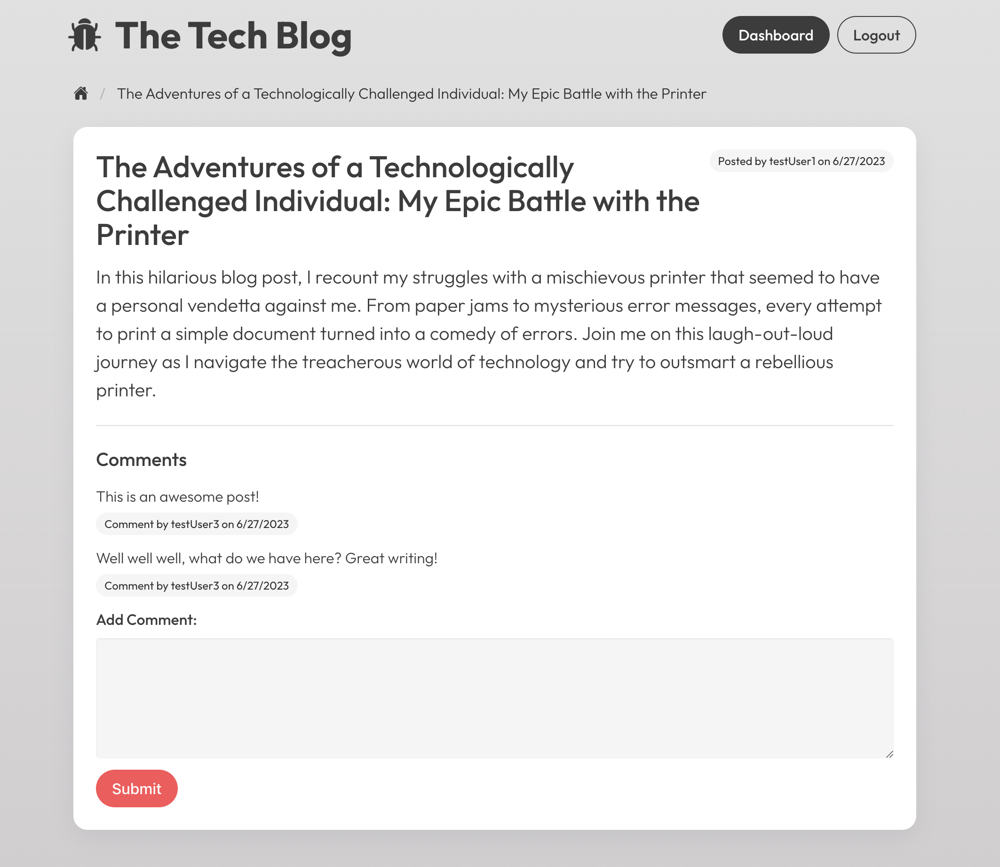

# Model-View-Controller (MVC): Tech Blog
## Description
A CMS-style blog site similar to a Wordpress site, where developers can publish their blog posts and comment on other developers’ posts as well.
## Installation

N/A

## Usage
1. Visit [deployed site here](https://infinite-reaches-27872-0c8235452d44.herokuapp.com/)
2. Sign up
3. Create new post in dashboard
4. View newly created post in the homepage
5. View other posts and add comments
6. Edit your post
7. See updated post on homepage
## What it should look like
### Homepage:

### Login:

### Signup:

### Dashboard:

### Create new post:

### Edit post:

### View post:

### Add comment:

## Credits
* Framework: [Bulma](https://bulma.io/)
* Icons: [Ionicons](https://ionic.io/ionicons)
## License

MIT license - Please refer to the LICENSE in the repo for more info.